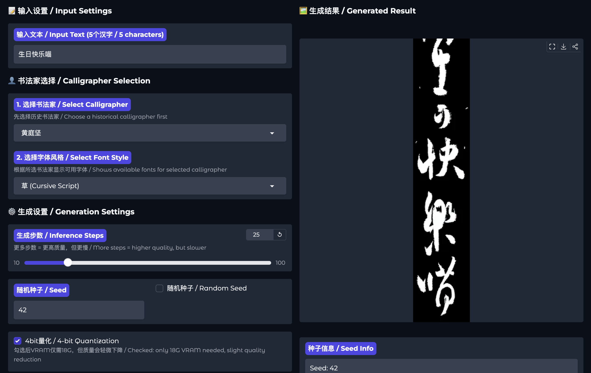

# [ICLR26]UniCalli: A Unified Diffusion Framework for Column-Level Generation and Recognition of Chinese Calligraphy

[](https://arxiv.org/abs/2510.13745)
[](https://envision-research.github.io/UniCalli/)
[](https://huggingface.co/spaces/TSXu/UniCalli_Dev)
[](https://huggingface.co/TSXu/Unicalli_Pro)
[](https://www.modelscope.cn/models/tianshuo/UniCalli-base)
[](https://github.com/EnVision-Research/UniCalli)

English | [简体中文](README_zh.md)

<p align="center">
  
</p>

## Overview

UniCalli is a groundbreaking unified diffusion framework that addresses column-level generation of Chinese calligraphy. Unlike existing methods that focus on isolated character generation or compromise calligraphic correctness for page-level synthesis, UniCalli integrates both recognition and generation tasks in a single model, achieving superior results in both stylistic fidelity and structural accuracy.


### Key Features

- **Unified Architecture**: First framework to unify column-level calligraphy generation and recognition
- **Multi-Master Styles**: Supports diverse calligraphic styles, including Wang Xizhi, Yan Zhenqing, Ouyang Xun, etc.
- **Densely Annotated Data**: Trained on large-scale calligraphy dataset with detailed annotations

## Licence
For academic research and non-commercial use only. 

本模型仅供学术研究、非商业使用。

## TODO List

- [x] **Model Release** - Base version without pred_box
- [x] **Inference Code**
- [x] **4-bit Quantization** - Only requires 18G GPU memory!
- [x] **Interactive Demo**
- [ ] **Dataset Release**
- [ ] **Training Code**

## Getting Started

### Installation

```bash
git clone https://github.com/EnVision-Research/UniCalli.git
cd UniCalli
pip install -r requirements.txt
```

### Download Model

Download the complete model package (includes checkpoint, InternVL embedding, and font) from Hugging Face:

```bash
# Using huggingface-cli (recommended)
huggingface-cli download TSXu/UniCalli-base --local-dir ./checkpoints
```

Or from ModelScope:

```bash
# Using modelscope
pip install modelscope
python -c "from modelscope import snapshot_download; snapshot_download('tianshuo/UniCalli-base', local_dir='./checkpoints')"
```

## Usage 

### Run Demo (Gradio Interface)

```bash
python app.py
```

### 4-bit Quantization (GPU Memory < 18GB)


 ⚠️ **Note**: 4-bit quantization significantly reduces VRAM usage but may result in slightly degraded output quality.

```bash
pip install optimum-quanto
```

```python
from inference import CalligraphyGenerator

generator = CalligraphyGenerator(
    model_name="flux-dev",
    device="cuda",
    offload=False,
    intern_vlm_path="./checkpoints/internvl_embedding",  # Path to downloaded embedding
    checkpoint_path="./checkpoints/unicalli-base_cleaned.bin",
    font_descriptions_path='dataset/chirography.json',
    author_descriptions_path='dataset/calligraphy_styles_en.json',
    use_deepspeed=False,
    use_4bit_quantization=True,  # Enable 4-bit quantization
)

image, cond_img = generator.generate(
    text="生日快乐喵",  # Must be 5 characters
    font_style="草",    # 楷(Regular)/草(Cursive)/行(Running)
    author="黄庭坚",    # Or None to use synthetic style
    save_path="output.png",
    num_steps=25,
    seed=42,
)
```

### Using DeepSpeed for Memory Optimization (GPU Memory < 40G)


```python
from inference import CalligraphyGenerator

generator = CalligraphyGenerator(
    model_name="flux-dev",
    device="cuda",
    offload=False,  # DeepSpeed manages memory
    intern_vlm_path="./checkpoints/internvl_embedding",  # Path to downloaded embedding
    checkpoint_path="./checkpoints/unicalli-base_cleaned.bin",
    font_descriptions_path='dataset/chirography.json',
    author_descriptions_path='dataset/calligraphy_styles_en.json',
    use_deepspeed=True,
    use_4bit_quantization=False,
    deepspeed_config="ds_config_zero2.json"
)

image, cond_img = generator.generate(
    text="生日快乐喵",  # Must be 5 characters
    font_style="楷",    # 楷(Regular)/草(Cursive)/行(Running)
    author="赵佶",    # Or None to use synthetic style
    save_path="output.png",
    num_steps=39,
    seed=1128293374,
)
```

### Supported Font Styles

- **楷 (Regular Script / Kaishu)**: Standard, block-style characters
- **行 (Running Script / Xingshu)**: Semi-cursive, flowing style
- **草 (Cursive Script / Caoshu)**: Highly cursive, artistic style

### Supported Calligraphy Masters

The model supports various historical calligraphy masters including:
- 王羲之 (Wang Xizhi) - "Sage of Calligraphy"
- 颜真卿 (Yan Zhenqing) - Tang Dynasty master
- 欧阳询 (Ouyang Xun) - One of the Four Great Masters
- 赵佶 (Emperor Huizong) - Song Dynasty emperor and calligrapher
- And many more...

You can also use `author=None` to generate in a synthetic, averaged style.

## Model Details

- **Base Architecture**: FLUX diffusion model
- **Model Size**: ~23GB
- **Input**: Text (5 characters), font style, author style
- **Output**: Column-level calligraphy image
- **Training Data**: Large-scale Chinese calligraphy dataset with dense annotations


## Citation

If you find UniCalli useful in your research, please consider citing:

```bibtex
@article{xu2025unicalli,
  title={UniCalli: A Unified Diffusion Framework for Column-Level Generation and Recognition of Chinese Calligraphy},
  author={Xu, Tianshuo and Wang, Kai and Chen, Zhifei and Wu, Leyi and Wen, Tianshui and Chao, Fei and Chen, Ying-Cong},
  journal={arXiv preprint arXiv:2025.13745},
  year={2025}
}
```

## Acknowledgments

This work builds upon the FLUX architecture and benefits from the rich heritage of Chinese calligraphy. We thank the calligraphy masters whose works made this research possible.

